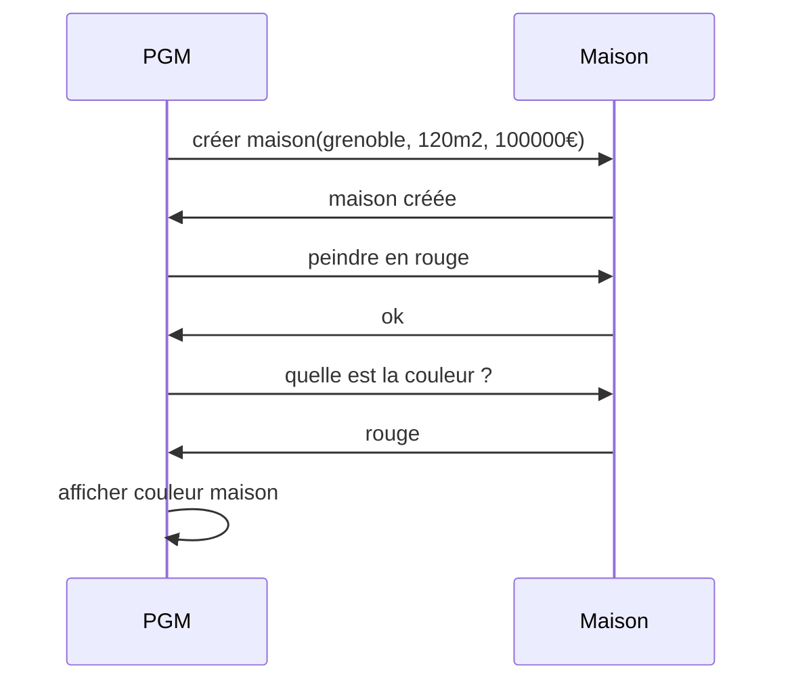

# Devoir - Conception logicielle

## 1 - From code to UML

A partir du code suivant, réaliser :
1. le diagramme de classe avec Mermaid ( / 4)
```ts
classDiagram
    Person
    Person : +string name
    Person : +number age
    Person: +veillir()
    Person: +mourir()
    Person: +renaissance()
```
2. le diagramme de séquence avec Mermaid ( / 8)
```ts
/*
sequenceDiagram

    participant Prgm
    actor Person 

    Prgm->>Person: Demander des infos (name, age, vivant?)
    Person ->> Prgm : Réponse
    Prgm->>Person: 
    Person ->> Prgm : 
    Prgm->>Person:     
    Person ->> Prgm : 
*/
```

```typescript
class Person {
  public name: string;
  public age: number;
  public vivant: boolean = true;

  constructor(name, age) {
    this.name = name;
    this.age = age;
    this.vivant = true;
  }

  veillir() {
    this.age++;
  }

  mourir() {
    this.vivant = false;
    console.log("Mesdames, Messieurs, Aurevoir");
  }

  renaissance() {
    this.age = 0;
    this.vivant = true;
  }
}

const student = new Person("Jean", 20);
student.veillir();
console.log("age de l'étudiant", student.age);
student.mourir();
console.log("décès d'un étudiant parti trop tôt");
student.renaissance()
console.log("fausse joie, il est de retour pour vous jouer un mauvais tour", student.age);
```

## 2 - From UML to code

A partir du diagramme de séquence suivant, réaliser :
1. le diagramme de classe avec Mermaid ( / 5)
``` ts
classDiagram
    class Maison{
    +string : couleur
    +string : infoMaison
    +creerMaison(grenoble, 120m2, 100000€)
    +peindre()
    }

```
2. le code correspondant ( / 3)
``` ts
class Maison{
    public _couleur:string;
    public _infoMaison:string;

    constructor(couleur:string, infoMaison:string){
        this._couleur = couleur;
        this._infoMaison = infoMaison;
    }

    creerMaison(){
        return this._infoMaison;
    }

    peindre(){
        return this._couleur;
    }
}

const m = new Maison("rouge");
m.peindre()
console.log("La couleur de la maison est " + m.peindre())
```



