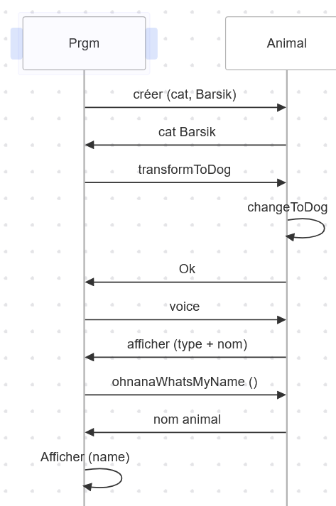
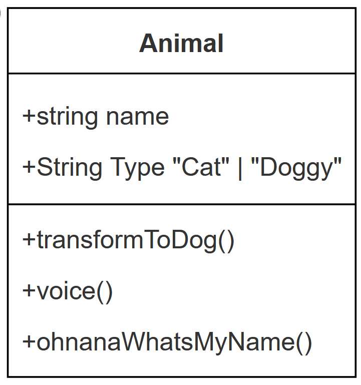

# Diagram

## Séquence
```ts
class Animal {
  public name: string;
  public type: string;
 
  constructor(type: string, name: string) {
      this.name = name;
      this.type = type
  }
  voice() {
      console.log(`Cat ${this.name} says myau`);
  }
 
  transformToDog() {
      this.type = "Doggy";
  }
 
  ohNahnahWhatsMyName() {
    return this.name;
  }
 
}
 
const cat = new Animal("Cat", "Barsik");
// Transition animale
cat.transformToDog();
cat.voice();
 
const animalName = cat.ohNahnahWhatsMyName();
console.log("nom de l'animal après transformation : " + animalName);


/* New code avec get/set*/

class Animal {
  public name: string;
  private _type: string;
 
  constructor(type: string, name: string) {
      this.name = name;
      this._type = type
  }
  
  voice() {
      console.log(`Cat ${this.name} says myau`);
  }
 
  transformToDog() {
      this._type = "Doggy";
  }
 
  ohNahnahWhatsMyName() {
    return this.name;
  }
 
  get type(){
    return this._type
  }
 
  set type(newType: string){
    this._type = newType
  }
 
}
 
const cat = new Animal("Cat", "Barsik");
// Transition animale
cat.transformToDog();
cat.voice();
 
cat.type = "Grenouille"
cat.name = "Toto"
 
const animalName = cat.ohNahnahWhatsMyName();
console.log("nom de l'animal après transformation : " + animalName);

```
*Code de diagramme de séquence*

``` ts
sequenceDiagram

    participant Prgm
    participant Animal

    Prgm->>Animal: créer (cat, Barsik)
    Animal ->> Prgm : cat Barsik
    Prgm->>Animal: transformToDog
    Animal->> Animal : changeToDog
    Animal ->> Prgm : Ok
    Prgm->>Animal: voice
    Animal ->> Prgm : afficher (type + nom)
    Prgm->>Animal: ohnanaWhatsMyName ()
    Animal ->> Prgm : nom animal
    Prgm ->> Prgm : Afficher (name)
```


## Class
``` ts
classDiagram
    Animal
    Animal : +string name
    Animal : +String Type "Cat" | "Doggy"
    Animal: +transformToDog()
    Animal: +voice()
    Animal: +ohnanaWhatsMyName()
```
