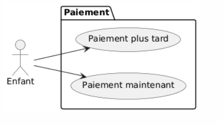
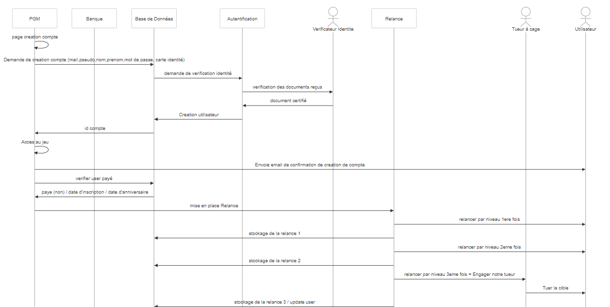
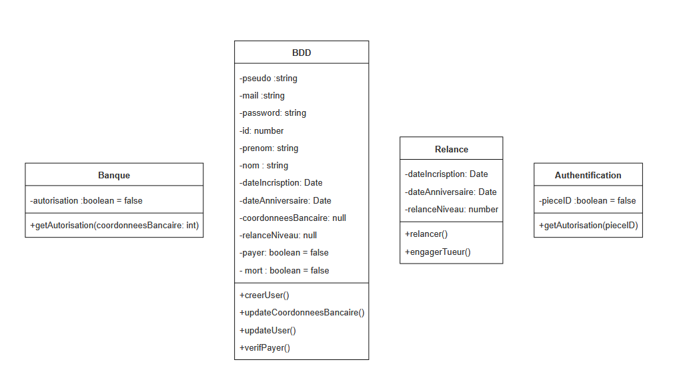

# Conception logiciel
## Sujet
Création d'un site / jeu vidéo pour une formation sur le DarkWeb avec un système d'abonnement de paiement.

On se concentre sur "Conclure" du tunnel d'achat.
## Cibles
Mineurs et étudiants (-25 ans)
### Use case
Code sur PlantUML WebServer
[Lien](https://www.plantuml.com/plantuml/uml/JP3D2eCm48JlUOh5kmUrvoBOdwi8VO0bRcBG9YNPj9JITwzQ2TvczviPbgq3e-TudyH4Ye4TUAC7XjvuacoS5IZPURX62WmOG8i7oX4rGUkTeX1c3qxm4G1_PpEGMemoRRABSpqqth2HsOAK5DzKqyt563rQNajY88c183iZmn9S4xUcsBCMtw3cvXqlz_paZHqtKEr1Hqz3huqSvYkKX3m_heFUL95KcLGbQhBzygOV)

```
@startuml
left to right direction
actor Enfant as e
 
package Paiement {
  usecase "Paiement maintenant" as UC1
  usecase "Paiement plus tard" as UC2
 
 
}
 
e --> UC1
e --> UC2
@enduml
```

### Paiement maintenant
#### Séquence

```ts
     participant PGM
    participant Banque
    participant Base de Données
    actor Utilisateur
 
    PGM->>Base de Données: Creation user anonyme (pseudo, mail)
    Base de Données->>PGM: id compte anonyme et adresse mail
    PGM->>PGM: Rediriger vers un lien paiement Paypal ou Visa
    PGM->>PGM: remplir renseignement paiement
    PGM->>Banque: Envoie détails de transaction + autorisation
    Banque->>PGM: Autorisation
    PGM->>PGM: Confirmation de paiement
    PGM->>Base de Données: Met à jour informations utilisateur donnée bancaire
    Base de Données->>PGM: Confirmation de mise à jour
    PGM ->> PGM: Acces au jeu
    PGM->>Utilisateur: Envoie email de confirmation d achat et de création de compte
    Utilisateur ->> PGM: Redirection page creation compte (id compte anonyme)
    PGM ->> PGM:  completer compte
    PGM->>Base de Données: Met à jour informations utilisateur complet (email?, mtp,id compte anonyme)
    Base de Données->>PGM: ok
    PGM ->>Utilisateur : Mail de confirmation creation du compte
```


#### Class

```ts
classDiagram
    class Banque{
        -autorisation :boolean = false
        + getAutorisation (coordonneesBancaire: int)
    }
    

    class BDD {
        -pseudo :string
        -mail :string
        -id: null
        -prenom: null
        -nom : null
        -coordonneesBancaire: null
        + creerUser()
        + updateCoordonneesBancaire()
        + updateUser()
    }
   
```


#### Code

```ts
class BDD {
  public _pseudo: string;
  public _mail: string;
  public _id: number = null;
  public _prenom : string = null;
  public _nom : string = null;
  public _coordonneesBancaire : number ;
  public _password: string =null;
 
  constructor(pseudo: string, mail: string) {
      this._pseudo = pseudo;
      this._mail = mail;
  }
 
  creerUser() {
       return this._id= Math.floor(1000);
  }
 //
  updateCoordoneeBancaire(newCoordonneesBancaire: number) {
      return this._coordonneesBancaire= newCoordonneesBancaire;
  }
 
  updateUser(nom: string, prenom: string, password: string){
        this._nom = nom;
        this._prenom = prenom;
        this._password = password;
        return this;
    }
}
 
 
class Banque {
  public _autorisation: boolean = false;
 
  constructor() {
  }
 
  getAutorise(coordonneesBancaire: number) {
       return this._autorisation= true;
  }
 //
}
 
 
const coco = new BDD("Coco38", "coco@gmail.com");
coco.creerUser()
console.log("Bienvenue "+ coco._pseudo)
 
coco.updateCoordoneeBancaire(152645)
coco.updateUser("Russi","Coralie","toto38")
console.log(coco)
 
const bank = new Banque()
bank.getAutorise(coco._coordonneesBancaire)
console.log(bank)

```

### Paiement plus tard
#### Diagramme de séquence
``` ts
sequenceDiagram
    participant PGM
    participant Banque
    participant Base de Données
    participant Autentification
    actor Verificateur Identite
    participant Relance
    actor Tueur à cage
    actor Utilisateur
 
    PGM ->>PGM : page creation compte
    PGM->>Base de Données: Demande de creation compte (mail,pseudo,nom,prenom,mot de passe, carte identité)
    Base de Données ->> Autentification : demande de verification identité
    Autentification ->> Verificateur Identite : verification des documents reçus
    Verificateur Identite ->> Autentification : document certifié
    Autentification ->> Base de Données : Creation utilisateur
    Base de Données->>PGM: id compte
    PGM ->> PGM: Acces au jeu
    PGM->> Utilisateur: Envoie email de confirmation de creation de compte
    PGM ->> Base de Données : verifier user payé
    Base de Données ->> PGM : paye (non) / date d'inscription / date d'anniversaire
    PGM ->> Relance : mise en place Relance
    Relance ->> Utilisateur : relancer par niveau 1ere fois
    Relance ->> Base de Données: stockage de la relance 1
    Relance ->> Utilisateur : relancer par niveau 2eme fois
    Relance ->> Base de Données: stockage de la relance 2
    Relance ->> Tueur à cage : relancer par niveau 3eme fois = Engager notre tueur
    Tueur à cage ->> Utilisateur : Tuer la cible
    Relance ->> Base de Données: stockage de la relance 3 / update user
```



#### Diagramme de classe

```ts
classDiagram
    class Banque{
        -autorisation :boolean = false
        + getAutorisation (coordonneesBancaire: int)
    }
    

    class BDD {
        -pseudo :string
        -mail :string
        -password: string
        -id: number
        -prenom: string
        -nom : string
        -dateIncrisption: Date
        -dateAnniversaire: Date
        -coordonneesBancaire: null
        -relanceNiveau: null
        -payer: boolean = false
        - mort : boolean = false
        + creerUser()
        + updateCoordonneesBancaire()
        + updateUser()
        + verifPayer()
    }
   
   class Relance{
    -dateIncrisption: Date
    -dateAnniversaire: Date
    -relanceNiveau: number
    +relancer()
    +engagerTueur()
   }

   class Authentification{
    -pieceID :boolean = false
    + getAutorisation (pieceID)
   }

```


