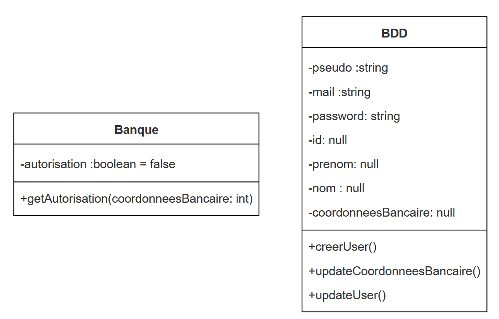

# Conception logiciel
## Sujet
Création d'un site / jeu vidéo pour une formation sur le DarkWeb avec un système d'abonnement de paiement.

On se concentre sur "Conclure" du tunnel d'achat.
## Cibles
Mineurs et étudiants (-25 ans)
## Diagramme
### Use case

### Séquence
#### Paiement maintenant

```ts
     participant PGM
    participant Banque
    participant Base de Données
    actor Utilisateur
 
    PGM->>Base de Données: Creation user anonyme (pseudo, mail)
    Base de Données->>PGM: id compte anonyme et adresse mail
    PGM->>PGM: Rediriger vers un lien paiement Paypal ou Visa
    PGM->>PGM: remplir renseignement paiement
    PGM->>Banque: Envoie détails de transaction + autorisation
    Banque->>PGM: Autorisation
    PGM->>PGM: Confirmation de paiement
    PGM->>Base de Données: Met à jour informations utilisateur donnée bancaire
    Base de Données->>PGM: Confirmation de mise à jour
    PGM ->> PGM: Acces au jeu
    PGM->>Utilisateur: Envoie email de confirmation d achat et de création de compte
    Utilisateur ->> PGM: Redirection page creation compte (id compte anonyme)
    PGM ->> PGM:  completer compte
    PGM->>Base de Données: Met à jour informations utilisateur complet (email?, mtp,id compte anonyme)
    Base de Données->>PGM: ok
    PGM ->>Utilisateur : Mail de confirmation creation du compte
```


#### Paiement plus tard

### Classe

#### Paiement maintenant

```ts
classDiagram
    class Banque{
        -autorisation :boolean = false
        + getAutorisation (coordonneesBancaire: int)
    }
    

    class BDD {
        -pseudo :string
        -mail :string
        -id: null
        -prenom: null
        -nom : null
        -coordonneesBancaire: null
        + creerUser()
        + updateCoordonneesBancaire()
        + updateUser()
    }
   
```


#### Paiement plus tard

```ts

```

### Code
#### Paiement maintenant

```ts
/*BDD*/
class BDD {
  public _pseudo: string;
  public _mail: string;
  public _id: number = null;
  public _prenom : string = null;
  public _nom : string = null;
  public _coordonneesBancaire : number ;
  public _password: string =null;
 
  constructor(pseudo: string, mail: string) {
      this._pseudo = pseudo;
      this._mail = mail;
  }
 
  creerUser() {
       return this._id= Math.floor(65165165165);
  }

  updateCoordoneeBancaire(newCoordonneesBancaire: number) {
    console.log ("Confirmation de mise à jour")
    return this._coordonneesBancaire= newCoordonneesBancaire;
  }
 
  updateUser(nom: string, prenom: string, password: string){
    this._nom = nom;
    this._prenom = prenom;
    this._password = password;
    return this;
    }
 
 
}

const coco = new BDD("Coco38", "coco@gmail.com");
coco.creerUser()
console.log("Redirection vers un lien paiement Paypal ou Visa")
console.log ("Remplir renseignement de paiement : ")

coco.updateCoordoneeBancaire(152645)
console.log("Accès au jeu")
console.log("Compléter le compte")
coco.updateUser("Russi","Coralie","toto38")
console.log(coco)

/*Banque*/


```